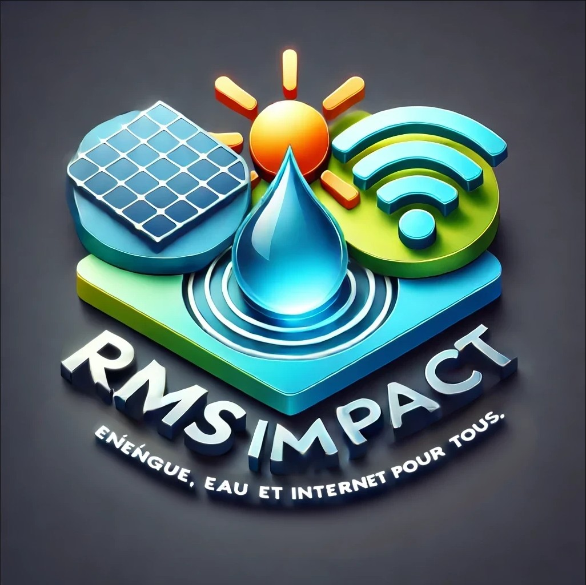

# README - Déploiement du Site RMS Impact

Ce guide explique comment déployer le site web statique de RMS Impact en utilisant les services AWS S3 et CloudFront. Cette méthode est performante, sécurisée et économique.

**Domaine :** `rmsimpact.org` (géré par Gandi.net)
**Contact :** `contact@rmsimpact.org`

## Prérequis

1.  Un compte AWS.
2.  Le nom de domaine `rmsimpact.org` enregistré chez Gandi.net.
3.  Tous les fichiers du site web prêts à être téléversés.

## Étape 1 : Créer un Certificat SSL avec AWS Certificate Manager (ACM)

Pour que votre site soit sécurisé (HTTPS), il faut un certificat SSL.

1.  Ouvrez la console AWS et allez dans **Certificate Manager (ACM)**.
2.  **IMPORTANT :** Assurez-vous d'être dans la région **USA Est (Virginie du Nord) us-east-1**. C'est une exigence de CloudFront.
3.  Cliquez sur **"Demander un certificat"** et choisissez **"Demander un certificat public"**.
4.  Entrez les noms de domaine :
    * `rmsimpact.org`
    * `*.rmsimpact.org` (pour couvrir tous les sous-domaines comme `www`)
5.  Choisissez la **"Validation DNS"** comme méthode de validation. C'est la plus simple.
6.  AWS vous fournira des enregistrements **CNAME** à ajouter à votre configuration DNS chez GoDaddy.
7.  Connectez-vous à votre compte **GoDaddy**, allez dans la gestion DNS de `rmsimpact.org` et ajoutez les enregistrements CNAME fournis par AWS.
8.  Attendez quelques minutes (parfois jusqu'à 30 minutes) qu'AWS valide la propriété du domaine. Le statut du certificat passera à **"Délivré"**.

## Étape 2 : Créer un Bucket S3 pour héberger les fichiers

Le bucket S3 stockera tous vos fichiers HTML, CSS, JS et images.

1.  Dans la console AWS, allez dans le service **S3**.
2.  Cliquez sur **"Créer un bucket"**.
3.  **Nom du bucket :** Il est recommandé d'utiliser le nom de domaine, par exemple `rmsimpact-website-files`. Le nom doit être unique globalement.
4.  **Région AWS :** Choisissez une région proche de votre public cible (par ex., `eu-west-3` pour Paris).
5.  **Bloquer tout accès public :** Laissez cette option **cochée**. L'accès se fera via CloudFront, pas directement via S3, ce qui est plus sécurisé.
6.  Cliquez sur **"Créer le bucket"**.
7.  Une fois créé, sélectionnez votre bucket et cliquez sur **"Charger"**. Téléversez toute l'arborescence de votre site (fichiers et dossiers).

## Étape 3 : Configurer CloudFront pour la Distribution de Contenu

CloudFront est le CDN (Content Delivery Network) d'AWS. Il va distribuer votre site rapidement et de manière sécurisée.

1.  Allez dans le service **CloudFront** sur la console AWS.
2.  Cliquez sur **"Créer une distribution"**.
3.  **Origine :** Dans le champ "Domaine d'origine", sélectionnez le bucket S3 que vous venez de créer.
4.  **S3 bucket access :**
    * Sélectionnez **"Yes, use OAI (Origin Access Identity)"**.
    * Cliquez sur **"Create new OAI"** et donnez-lui un nom.
    * Choisissez **"Yes, update the bucket policy"**. AWS mettra automatiquement à jour la politique de votre bucket S3 pour autoriser CloudFront à y accéder.
5.  **Default cache behavior :**
    * **Viewer protocol policy :** Sélectionnez **"Redirect HTTP to HTTPS"** pour forcer l'utilisation du SSL.
6.  **Settings :**
    * **Alternate domain name (CNAME) :** Ajoutez `rmsimpact.org` et `www.rmsimpact.org`.
    * **Custom SSL certificate :** Sélectionnez le certificat que vous avez créé à l'étape 1.
    * **Default root object :** Entrez `index.html`. Cela indique à CloudFront quel fichier charger lorsque quelqu'un visite la racine de votre domaine.
7.  Cliquez sur **"Create distribution"**. Le déploiement peut prendre environ 15 minutes.

## Étape 4 : Mettre à jour les DNS chez Gandi.net

La dernière étape consiste à faire pointer votre nom de domaine vers la distribution CloudFront.

1.  Dans la console CloudFront, sélectionnez votre distribution. Copiez le **"Nom de domaine de la distribution"** (ex: `d12345abcdef.cloudfront.net`).
2.  Retournez sur votre compte **Gandi.net** dans la gestion DNS pour `rmsimpact.org`.
3.  Modifiez (ou créez) l'enregistrement `CNAME` pour `www` :
    * **Type :** CNAME
    * **Nom :** `www`
    * **Valeur :** Collez le nom de domaine de votre distribution CloudFront.
4.  Pour le domaine racine (`rmsimpact.org`),.

<<<<<<< HEAD
Attendez la propagation des DNS (cela peut prendre de quelques minutes à quelques heures). Une fois terminé, votre site `https://www.rmsimpact.org` sera en ligne, sécurisé et servi via CloudFront.# rmsimpact-website
=======
Attendez la propagation des DNS (cela peut prendre de quelques minutes à quelques heures). Une fois terminé, votre site `https://www.rmsimpact.org` sera en ligne, sécurisé et servi via CloudFront.

######################################################################################################################################################################################

# Site Institutionnel - RMS Impact



[](https://www.rmsimpact.org)

[cite_start]Ce dépôt contient le code source du site web institutionnel pour **RMS Impact**, une initiative de RMS International Group. [cite: 4] [cite_start]Le projet vise à fournir un accès durable et abordable à l'énergie, à l'eau potable et à Internet pour les populations des zones rurales mal desservies en Afrique, en s'alignant sur les Objectifs de Développement Durable (ODD). [cite: 5, 28]

---

## Table des Matières
1.  [À propos du projet](#à-propos-du-projet)
2.  [Fonctionnalités](#fonctionnalités)
3.  [Technologies Utilisées](#technologies-utilisées)
4.  [Structure des Fichiers](#structure-des-fichiers)
5.  [Déploiement sur AWS](#déploiement-sur-aws)
6.  [Contact](#contact)

---

## À propos du projet

Le site web a pour vocation de servir de support principal à la communication stratégique de RMS Impact. Il est destiné à un public varié incluant les gouvernements, les bailleurs de fonds internationaux (Union Européenne, USAID, BAD, ONU), les investisseurs privés et les philanthropes.

Ses objectifs sont de :
* Présenter la mission humanitaire et économique de l'entreprise.
* Mettre en valeur le modèle économique viable et les projets.
* Servir de plateforme pour la levée de fonds et le dialogue avec les partenaires.

---

## Fonctionnalités

* **Site Multilingue :** Français / Anglais.
* **Design Responsive :** Adapté aux ordinateurs, tablettes et smartphones.
* **Présentation Complète :** Pages Accueil, À Propos, Gouvernance, Projets, Investisseurs, etc.
* **Composants Dynamiques :** Menu des pays cibles, affichage des ODD.
* **Optimisé SEO :** Balises Méta et Open Graph pour un meilleur référencement.
* **Prêt pour le Contact :** Formulaire de newsletter et informations de contact claires.

---

## Technologies Utilisées

* **HTML5**
* **CSS3** (avec variables pour une maintenance facile de la charte graphique)
* **JavaScript (ES6)** pour les fonctionnalités dynamiques (chargement du header/footer).
* **Bootstrap 5** pour le framework responsive.

---

## Structure des Fichiers

```
/
├── index.html
├── about.html
├── leadership.html
├── projects.html
├── investors.html
├── blog.html
├── press.html
├── terms.html
├── privacy.html
├── legal.html
├── index_en.html (et toutes les autres pages en version anglaise)
├── partials/
│   ├── header.html
│   ├── footer.html
│   ├── header_en.html
│   └── footer_en.html
├── css/
│   └── style.css
├── js/
│   └── main.js
├── assets/
│   ├── images/
│   │   └── logo.jpg
│   └── docs/
│       └── (Dossiers PDF à ajouter ici)
├── README.md
└── ... (autres fichiers de configuration comme sitemap.xml)
```

---

## Déploiement sur AWS

Ce site est conçu pour être déployé en tant que site statique sur **Amazon S3** avec une distribution **CloudFront** pour la performance et la sécurité (HTTPS).

### Étapes de déploiement

1.  **Créer un Certificat SSL (ACM) :**
    * Dans la console AWS, allez sur **Certificate Manager (ACM)** en région **us-east-1 (N. Virginia)**.
    * Demandez un certificat public pour `rmsimpact.org` et `*.rmsimpact.org`.
    * Validez la propriété du domaine en ajoutant les enregistrements CNAME fournis par AWS dans votre interface DNS (Gandi.net).

2.  **Créer un Bucket S3 :**
    * Allez sur le service **S3** et créez un bucket (ex: `rmsimpact-website-prod`).
    * Laissez l'option "Bloquer tout accès public" cochée par sécurité.
    * Chargez tous les fichiers de votre site dans ce bucket en respectant l'arborescence.

3.  **Configurer une Distribution CloudFront :**
    * Allez sur le service **CloudFront** et créez une nouvelle distribution.
    * **Origin domain :** Sélectionnez votre bucket S3.
    * **S3 bucket access :** Cochez "Yes, use OAI" et créez une nouvelle OAI. Cochez "Yes, update the bucket policy" pour autoriser CloudFront à lire les fichiers.
    * **Viewer protocol policy :** Sélectionnez "Redirect HTTP to HTTPS".
    * **Alternate domain name (CNAME) :** Ajoutez `rmsimpact.org` et `www.rmsimpact.org`.
    * **Custom SSL certificate :** Sélectionnez le certificat créé à l'étape 1.
    * **Default root object :** Entrez `index.html`.
    * Créez la distribution.

4.  **Configurer les DNS (chez Gandi.net) :**
    * Récupérez le nom de domaine de votre distribution CloudFront (ex: `d123abcdef.cloudfront.net`).
    * Chez Gandi, créez/modifiez les enregistrements DNS pour `rmsimpact.org` :
        * **Pour `www` :** Un enregistrement `CNAME` pointant vers votre adresse CloudFront.
        * **Pour le domaine racine (`@`) :** Un enregistrement `ALIAS` pointant vers votre adresse CloudFront.

---

## Contact

Pour toute question ou proposition de partenariat, veuillez nous contacter à l'adresse : **contact@rmsimpact.org**.
>>>>>>> c56da4d2e788f241b55f8bba1d9a27119f38ef0e
